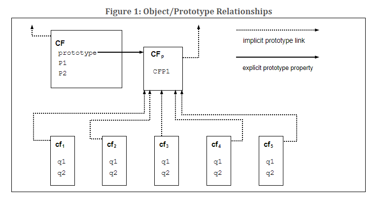

# 概述 ##
*第四章翻译参考https://realywithoutname.github.io/ecma262/#sec-normative-references*
本节包含对 ECMAScript 语言非规范性的概述。

ECMAScript 是在宿主环境中执行计算，处理对象的面向对象编程语言。 ECMAScript 是在宿主环境中执行计算，处理对象的面向对象编程语言。这里定义的 ECMAScript 并未打算要计算性自足；事实上，本规范没有任何针对输入外部数据或输出计算结果的条文。相反，，我们期望 ECMAScript 程序的计算环境可提供本规范中描述的对象和其它设施之外的、某些特定环境下的 宿主 (host) 对象，除了说明宿主对象应该提供可被 ECMAScript 程序访问的某些属性，调用的某些方法外，关于它的其他描述和行为超出了本规范涉及的范围。

ECMAScript最初被设计作为脚本语言使用，但已被广泛用作通用编程语言。脚本语言是一种用于操作，自定义，自动化现有系统设施的编程语言。在这种系统中，已经可以通过一个用户界面使用可用功能，脚本语言是一种机制，暴漏这些功能给程序控制。这样，现有系统可以说给完善脚本语言能力需要的对象和设施提供了一个宿主环境。脚本语言被设计成专业和非专业程序员都能使用。

 ECMAScript 最初被设计为 Web 脚本语言 ，提供了一种机制，使浏览器里的网页更加活跃，成为基于 Web 的客户 - 服务器架构的一部分执行服务器计算。ECMAScript 可以为各种宿主环境提供核心的脚本功能，因此本文档为不依赖特定宿主环境的核心脚本语言作出规范。

ECMAScript 的使用已经超越了简单的脚本编写，现在它被广泛用于不同环境和规模中的程序中。 随着 ECMAScript 的使用范围不断扩大，它提供的功能和工具也在不断扩展。 ECMAScript 现在是一种功能齐全的通用编程语言。

## 4.1 web脚本 ##

web浏览器为引入客户端侧的运算能力提供了ECMASCript宿主环境。例如，提供了windows，menus，pop-ups，dialog boxes，text areas，anchors，frames，history，cookies 及输入 / 输出等对象。进一步来说，WEB 浏览器中提供的这种宿主环境，它提供了一种方式，使得脚本代码可以去处理诸如改变焦点、页面和图片的加载、卸载、错误和放弃，选择，表单提交和鼠标交互等等事件。脚本代码出现在 HTML 中，显示出来的页面是一个用户接口元素与固定的和计算出来的文本和图片的集合。脚本代码根据用户的交互而做出反应，并不需要存在一个主程序。

WEB 服务器为了服务端的计算则提供了一个完全不一样的宿主环境，包括的对象有：requests，clients，files 以及数据锁定和分享的机制。通过浏览器端脚本及服务端脚本的配合使用，在为基于 WEB 方式的应用程序提供定制的用户接口时，可以将计算分布到客户端和服务端进行。

 每一种支持 ECMAScript 的 WEB 浏览器和服务器都将它们自身的宿主环境作为 ECMAScript 的补充，以使得 ECMAScript 的执行环境变得完整。

 ## 4.2 宿主和实现

 为了将ECMAScript集成到宿主环境中，本规范将某些功能的补充事项定义（例如抽象操作）的全部或部分放到了本规范之外。形式上，本规范大致分为以下几类。

*【注】以下翻译不到位，待理解后面了再来看看*
An implementation is an external source that further defines facilities enumerated in Annex D or those that are marked as implementation-defined or implementation-approximated. In informal use, an implementation refers to a concrete artefact, such as a particular web browser.
 实现是指对附录D所列举的功能或者那些被标记为实现定义或近似实现的功能的进一步说明的*外部源*(an external source)。非正式使用中，可以是一个具体的东西，比如说特定的web浏览器。

An implementation-defined facility is one that defers its definition to an external source without further qualification. This specification does not make any recommendations for particular behaviours, and conforming implementations are free to choose any behaviour within the constraints put forth by this specification.

一个实现定义的功能是指其定义由外部源决定，但没有进一步限制。本规范不对特定行为做出任何推荐，符合规范的实现可以在本规范提出的约束范围内自由选择任何行为。（例如：对于Date对象的实现，各大浏览器的差异可能会有细微差别）

An implementation-approximated facility is one that defers its definition to an external source while recommending an ideal behaviour. While conforming implementations are free to choose any behaviour within the constraints put forth by this specification, they are encouraged to strive to approximate the ideal. Some mathematical operations, such as Math.exp, are implementation-approximated.

近似实现的功能是指其定义由外部源决定，但同时推荐一个理想行为。虽然符合规范的实现可以在本规范提出的约束内自由选择任何行为，但鼓励他们努力接近理想行为。 例如一些数学运算， Math.exp，就是实现近似的。

A host is an external source that further defines facilities listed in Annex D but does not further define other implementation-defined or implementation-approximated facilities. In informal use, a host refers to the set of all implementations, such as the set of all web browsers, that interface with this specification in the same way via Annex D. A host is often an external specification, such as WHATWG HTML (https://html.spec.whatwg.org/). In other words, facilities that are host-defined are often further defined in external specifications.

宿主是一个外部源，它进一步定义了附录D中列举的功能，但没有进一步定义实现（implementation-defined）和近似实现（implementation-approximated）。非正式使用时，宿主指所有实现的集合，例如web浏览器，它们通过附录D的方式同样实现了符合本规范的接口。宿主通常是一个外部规范，例如例如 WHATWG HTML (https://html.spec.whatwg.org/)。换而言之，宿主定义的功能通常进一步定义在外部规范中。

A host hook is an abstract operation that is defined in whole or in part by an external source. All host hooks must be listed in Annex D. A host hook must conform to at least the following requirements:
宿主钩子（hook）是一种外部或部分由外部源定义的抽象操作。所有的宿主钩子必须在附录D中列出，所有的宿主钩子必须至少符合以下要求：

- 它必须返回一个正常的完成（normal completion）或一个抛出完成（ throw completion）

A host-defined facility is one that defers its definition to an external source without further qualification and is listed in Annex D. Implementations that are not hosts may also provide definitions for host-defined facilities.

宿主定义（host-defined）是指由外部源实现的没有进一步限制并在附录D中列出的定义。非宿主提供的实现也可以为宿主定义的功能提供定义。

宿主环境是为宿主定义功能提供的一种特殊选择。一个典型的宿主环境包括一个提供宿主定义属性全局对象，这个对象允许获得输入和提供输出的对象和函数。

本规范始终遵循使用最具体的属于的约定。例如，如果一个功能是宿主定义，它将不能被成为实现定义。

宿主和实现都可以通过本文中定义的语言类型、规范类型、抽象操作、语法、内在对象和内在符号与本规范进行交互.

## 4.3 ECMAScript概述
下面是非正式的 ECMAScript 概述 -- 并未描述语言的所有部分。此概述并非标准的一部分。

ECMAScript 是基于对象的：基本语言和宿主设施都由对象提供，ECMAScript 程序是一组可通信的对象。ECMAScript 是基于对象的：基础语言以及主要能力都是通过对象提供，一个 ECMAScript 程序是一组可通信对象。在 ECMAScript 中，一个对象是零个或多个属性的的集合。每个属性都有确定其如何被使用的特性， 如当一个属性的 Writable 特性设置为 false 时，执行任何尝试对该属性分配不同值的的 ECMAScript 代码都将失败。属性是其他对象，原始值，函数的容器。原始值是以下内置类型成员之一：Undefined, Null, Boolean, Number, BigInt(新增), String, and Symbol;一个对象是内置类型 Object 成员之一，一个函数是一个可调用对象。对象通过属性调用的函数叫做方法。

ECMAScript 定义了一组内置对象，从而勾勒出 ECMAScript 实体的定义。这些内置对象包括全局对象；基本的语言运行时语义对象，包括 Object, Function, Boolean, Symbol，各种 Error 对象；代表和操作的数值对象，包括 Math, Number, Date；文本处理对象，String，RegExp；索引值集合的 Array 对象，以及九种值具有特定数字数据表示的 Typed Array 对象；泛型对象(键值对集合) Map, Set；支持结构化数据的 JSON, ArrayBuffer, SharedArrayBuffer,DataView 等对象；支持控制抽象的 generator 函数，Promise 对象；以及反射对象 Proxy，Reflect。

ECMAScript 还定义了一组内置运算符。ECMAScript 运算符包括各种一元运算，乘法运算符，加法运算符，位移运算符，关系运算符，等式运算符，二进制运算符，二进制逻辑运算符，赋值运算符和逗号运算符。

大型 ECMAScript 程序通过模块被支持，其允许程序可以被分化为多个语句和定义序列。每个模块明确地标识它所使用的其他模块提供的声明，哪些声明可供其他模块使用。

ECMAScript 语法有意地类似于 Java 语法。ECMAScript 语法是松散的，使其能够成为易于使用的脚本语言。例如，一个变量不需要声明其具体类型，也不需要与声明相关联属性类型，在调用定义的函数之前也不需要以文本方式显示的声明。

### 4.3.1 对象

尽管 ECMAScript 包含了定义类的语法，但是 ECMAScript 对象从根本上来说并不是像 C++，Smalltalk，Java 那样基于类的。相反，对象可以通过各种方式创建，包括字面符号，或通过构造器创建对象然后运行代码初始化其全部或部分属性值，为这些属性分配初始值。每个构造器是一个拥有名为 "prototype" 的属性的函数，此属性用于实现基于原型的继承 和共享属性。构造器通过 new 表达式创建对象：例如,new Date(2009,11) 创建一个新 Date 对象。使不使用new调用一个构造器由构造器本身决定。例如，Date()会生成一个表示当前日期时间的字符串，而不是一个对象。

每个由构造器创建的对象，都有一个隐式引用(叫做对象的原型)链接到构造器的 "prototype" 属性值。再者，一个原型可能有一个非空隐式引用链接到它的原型，以此类推，这叫做原型链。当向对象的一个属性提出引用时，引用会指向原型链中包含此属性名的第一个对象的属性。换句话说，首先检查直接提及的对象的同名属性，如果对象包含同名的属性，引用即指向此属性，如果该对象不包含同名的属性，则下一步检查对象的原型；以此类推.

一般情况下基于类的面向对象语言，状态由实例承载，方法由类承载，并且只能继承结构和行为。在 ECMAScript 中，对象拥有状态和方法，并且结构，行为，状态全都可继承。

所有不直接包含特定属性的对象会共享他们原型中包含的此属性及属性值。图 1 说明了这一点：

CF 是一个构造器（也是一个对象）。五个对象已用 new 表达式创建: cf1, cf2, cf3, cf4, cf5。每个对象都有名为 q1 和 q2 的属性。虚线表示隐式原型关系；例如：cf3 的原型是 CFp。构造器 CF 自己有名为 P1 和 P2 的两个属性, 这对 CFp,cf1, cf2, cf3, cf4, cf5 是不可见的。CFp 的名为 CFP1 的属性共享给 cf1, cf2,cf3, cf4, 以及 cf5 ( 没有CF), 以及在 CFp 的隐式原型链中找不到任何名为 q1, q2,或 CFP1 的属性。请注意，CF 和 CFp 之间没有隐式原型链接。

不同于基于类的对象语言，属性可以通过赋值的方式动态添加给对象。也就是说，构造器并不是非要对构造的对象的全部或任何属性命名或赋值。上图中，可以给 CFp 添加新属性值的方式为 cf1, cf2, cf3, cf4,and cf5 添加一个新的共享属性。

尽管 ECMAScript 对象本质上不是基于类，但是基于构造函数，原型对象和方法通用模式来实现类似于类的抽象是很方便的。ECMAScript 内置对象本身即遵循这样的类模式。从 ECMAScript 2015 开始，ECMAScript 语言包含了类定义语法，允许程序员像内置对象那样简洁的定义对象。

### 4.3.2 ECMAScript 严格变体
ECMAScript 语言认识到有的开发者可能希望限制使用语言中的新特性。他们这样做可能是为了安全考虑，避免他们认为是容易出错的功能，获得增强的错误检查，或其他原因。因此，ECMAScript 中定义了语言的严格变体。语言的严格变体，排除了 ECMAScript 语言的某些特定的语法和语义特征，还修改了某些功能的详细语义。严格变体还指定了必须抛出错误异常报告的额外错误条件，即使在非严格的语言形式下这些条件不属于错误。

ECMAScript 的严格变体通常被称为语言的严格模式。严格模式选择和使用明确地适用于独特 ECMAScript 代码单元级别的，ECMAScript 严格模式语法和语义。由于语法代码单元级别的严格模式被选择，严格模式仅在这个代码单元内施加有局部效果的限制。严格模式不限制或修改任何层面的 ECMAScript 语义，必须一致地操作跨多个代码单元。一个 ECMAScript 程序可同时包含严格模式和非严格模式的代码单元。在这种情况下，严格的模式只适用于严格模式代码单元内实际执行的代码。

要符合这一规范，ECMAScript 的实现必须同时实现未限制的 ECMAScript 语言和按照这个规范定义的 ECMAScript 的严格模式变体。此外，实现还必须支持未限制的和严格模式代码单元的在同一个程序中混用。

## 4.4 术语和定义
本文档将使用下列术语和定义。

### 4.4.1 近似实现（implementation-approximated）

近似实现指定义全部或部分功能由外部源实现，但是在本规范中有推荐的理、想状态的行为。

### 4.4.2 实现定义（implementation-defined）

实现定义：全部或部分定义由本规范外的外部源实现

### 4.4.3 宿主定义（host-defined）

> NOTE 见条款4.2

### 4.4.4 类型（type）

在本规范6中定义的数据值集合。

### 4.4.5 原始值（primitive value）

指在条款6中定义的 Undefined, Null, Boolean, Number, BigInt, Symbol, String 类型之一

> NOTE 一个原始值直接代表语言实现的最低层次的数据

### 4.4.6 对象

Object 类型的成员

> NOTE 对象是属性的集合，并且具有单个原型对象。原型可能是空值。

### 4.4.7 构造函数
创建和初始化对象的函数对象
> NOTE 构造器的 prototype 属性值是用来实现继承和共享的一个原型对象。

### 4.4.8 原型
为其他对象提供共享属性的对象
> NOTE 当构造器创建一个对象，为了解决对象的属性引用，该对象会隐式引用构造器的 prototype 属性。通过程序表达式 _constructor_.prototype 可以引用到构造器的 prototype 属性，添加到对象原型里的属性是被共享的，通过继承，所有对象都共享此原型。另外，可使用Object.create内置函数，通过显式的指定原型来创建一个新对象。

### 4.4.9 普通对象（ ordinary object）
默认行为拥有如那些所有对象都必须支持的内部方法的对象

### 4.4.10 异常对象（exotic object）
默认行为缺少一个或多个必要内部方法的对象
> NOTE 任何对象不是普通对象就是异常对象。

### 4.4.11 标准对象
其语义由本规范定义的对象

### 4.4.12 内置对象（built-in object）
ECMAScript 实现指定和提供的对象
> NOTE  标准的内置对象由本规范定义，ECMAScript 实现可以指定和定义其他的一个内置构造器是个内置对象，也是个构造器。

### 4.4.13 未定义的值（undefined value）
一个在变量没有被赋值时就被使用的原始值

### 4.4.14 Undefined类型（Undefined type）
值只有 undefined 值的类型

### 4.4.15 空值（null value）
故意缺省任何对象值的原始值

### 4.4.16 Null类型（Null type）
值只有 null 值的类型

### 4.4.17 Boolean 值
Boolean 类型的成员
> NOTE 只有两个值, true 和 false。

### 4.4.18 Boolean 类型
由原始值 true 和 false 组成的类型

### 4.4.19 Boolean 对象
标准内置构造函数 Boolean 的实例，Object 类型成员之一
> NOTE 通过使用 new 表达式，以一个 Boolean 值作为参数调用 Boolean 构造器来创建 Boolean 对象。由此产生的对象包含一个值为此 Boolean 值的内部属性。一个 Boolean 对象可以强制转换为 Boolean 值。

### 4.4.20 String值
由零个或多个16位无符号整数组成的有限有序序列原始值
> NOTE 一个 String 值是 String 类型的成员。通常序列中的每个整数值代表 UTF-16 文本的单个 16 位单元。然而，对于其值，ECMAScript 只要求必须是 16 位无符号整数，除此之外没有任何限制或要求。

### 4.4.21 String类型
所有可能的 String 值的集合

### 4.4.22 String 对象
标准内置构造器 String 实例，Object 类型成员之一
> NOTE 通过使用 new 表达式，以一个 String 值为参数调用 String 构造器来创建 String 对象。由此产生的对象包含一个值为此 String 值的内部属性。将 String 构造器作为一个函数来调用，可将一个 String 对象强制转换为一个 String 值(22.1.1.1)

### 4.4.23 Number 值
对应IEEE 754-2019 格式的 64 位双精度二进制的原始值

> NOTE
一个数字值是数字类型的成员，直接代表一个数字。

### 4.4.24 Number 类型
所有可能的 Number 值的集合，包括特殊 “Not-a-Number” (NaN) 值, 正无穷, 负无穷

### 4.4.25 Number 对象
标准内置构造器 Number 的一个实例，Object 类型成员之一

> NOTE
通过使用 new 表达式，以一个数字值为参数调用 Number 构造器来创建 Number 对象。由此产生的对象包含一个值为此 Number 值的内部属性。将 Number 构造器作为一个函数来调用，可将一个 Number 对象强制转换为一个数字值(21.1.1.1)。

### 4.4.26 无穷（Infinity）
正无穷数值(*是否不严谨，负无穷为什么没纳入*)
Number value that is the positive infinite Number value

### 4.4.27 NaN
值 IEEE 754-2019 “Not-a-Number” 的数值

### 4.4.28 BigInt值
任意精度整数的原始值

### 4.4.29 BigInt类型
所有可能的BigInt值得集合

### 4.4.30 BigInt对象
标准内置构造器的实例，Object类型的成员之一

### 4.4.31 Symbol 值
表示一个唯一的，非字符串的属性键对象的原始值

### 4.4.32 Symbol 类型
所有可能的 Symbol 值集合

### 4.4.33 Symbol 对象
标准内置构造器 Symbol 的一个实例，Object 类型成员之一

### 4.4.34 函数（function）
可作为子程序调用的 Object 类型成员之一
> NOTE
函数除了其属性，还包含可执行代码、状态，用来确定被调用时的行为。函数的代码不限于 ECMAScript。

### 4.4.35 内置函数（built-in function）
作为函数的内置对象
> NOTE
如 parseInt 和 Math.exp 就是内置函数。一个宿主或实现可以提供本规范没有描述的额外的内置函数。

### 4.4.36  属性（property）
对象的一部分，将一个键（key，一个 String 值或 Symbor 值）和值关联起来
> NOTE
属性可能根据属性值的不同表现为直接的数据值（原始值，对象，或一个函数对象）或间接的一对访问器函数。

### 4.4.37 方法（method）
作为属性值的函数
> NOTE
当一个函数被作为一个对象的方法调用，此对象将作为 this 值传递给函数。

### 4.4.38 内置方法
作为内置函数的方法
> NOTE
标准内置方法由本规范定义，宿主或ECMAScript 实现可指定，提供其他额外的内置方法。

### 4.4.39 特性（attribute）
定义一个属性的一些特性的内部值

### 4.4.40 自身属性（own property）
对象直接拥有的属性

### 4.4.41 继承属性（ inherited property）
不是对象的自身属性，但是是对象原型的属性(原型的自身属性或继承属性)

## 4.5 本规范结构
本规范的剩余部分章节组织如下：
第 5 章定义了在本规范中使用的一些符号或者语法的约定。
第 6-10 章定义了 ECMAScript 程序操作包含的执行环境。
第 11-17 章定义了实际的 ECMAScript 语言，包括它的语法编码以及语言特性的执行语义。
第 18-28 章定义了 ECMAScript 标准库。它们包括所有当 ECMAScript 程序执行时可用的标准对象的定义。
第29章描述了通过SharedArrayBuffer共享内存和原子对象的方法（Atomics object）实现的内存一致性模型